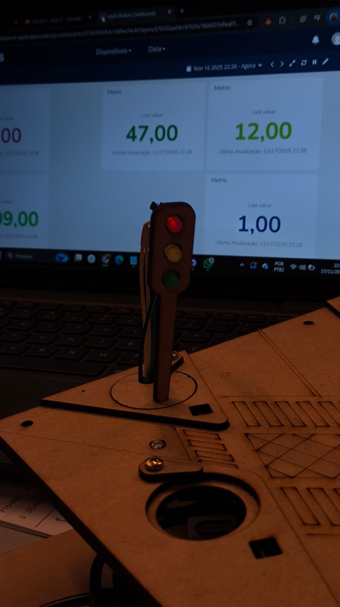
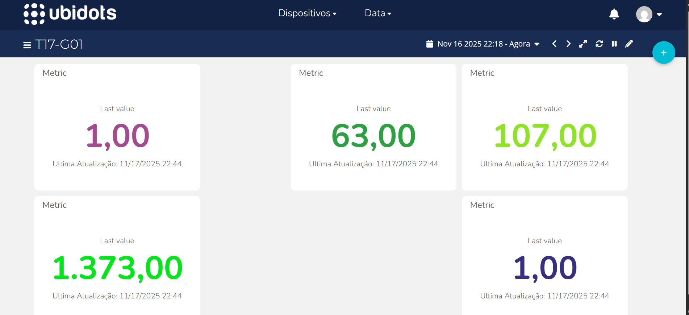

# Documentação — Semáforo Inteligente

## Sumário

<details>
  <summary><a href="#c1">1. Introdução</a></summary>
</details>

<details>
  <summary><a href="#c2">2. Objetivo</a></summary>
</details>

<details>
  <summary><a href="#c3">3. Desenvolvimento</a></summary>
  <ul>
    <li><a href="#c3.1">3.1. Montagem Física</a></li>
    <li><a href="#c3.2">3.2. Funcionamento do Sensor LDR</a></li>
    <li><a href="#c3.3">3.3. Lógica de Funcionamento do Semáforo</a></li>
    <li><a href="#c3.4">3.4. Comunicação entre os Dois Semáforos</a></li>
    <li><a href="#c3.5">3.5. Interface Online</a></li>
  </ul>
</details>

<details>
  <summary><a href="#c4">4. Resultados</a></summary>
</details>

<details>
  <summary><a href="#c5">5. Conclusão</a></summary>
</details>


# <a name="c1"></a>1. Introdução

&nbsp; O crescimento das cidades requer soluções modernas capazes de otimizar o tráfego urbano. Nesse contexto, tecnologias inteligentes, incluindo sensores, microcontroladores e sistemas interconectados, tornam-se fundamentais para melhorar o fluxo de veículos e reduzir congestionamentos.

&nbsp; Este projeto propõe a implementação de um **semáforo inteligente**, capaz de detectar a luminosidade ambiente, identificar a presença de veículos e alternar automaticamente entre modos de operação. Além disso, dois semáforos se comunicam por meio de uma plataforma IoT, simulando um sistema avançado de infraestrutura urbana.


# <a name="c2"></a>2. Objetivo

&nbsp; O objetivo do projeto é desenvolver um sistema funcional composto por dois semáforos controlados por ESP32, conectados a sensores LDR e integrados a uma interface online que permita visualizar dados e ajustar comportamentos.

**Objetivos específicos:**

* Implementar leitura de luminosidade via LDR;
* Alterar o comportamento do semáforo com base na luz ambiente (modo noturno);
* Construir dois semáforos físicos com LEDs;
* Integrar ambos à internet por meio do ESP32;
* Enviar dados para uma plataforma IoT (ex.: Ubidots);
* Permitir o controle e monitoramento remoto do sistema;
* Simular comunicação e sincronização entre dois semáforos.


# <a name="c3"></a>3. Desenvolvimento

## <a name="c3.1"></a>3.1. Montagem Física

<div align="center">
<sub>Figura 1 – Montagem física do protótipo</sub>  
  
<sup>Fonte: Material produzido pelos autores (2025)</sup>
</div>

<div align="center">
<sub>Figura 2 – Montagem física com os ESP</sub>  
  
<sup>Fonte: Material produzido pelos autores (2025)</sup>
</div>

### Componentes utilizados

* ESP32 (1 por semáforo)
* LDR
* LEDs vermelho, amarelo, verde
* Protoboard
* Resistores
* Jumpers

### Descrição da montagem

&nbsp; Os dois semáforos foram montados utilizando um ESP32 para cada unidade.

&nbsp; Para cada semáforo, os LEDs foram organizados verticalmente seguindo o padrão:

1. **LED Vermelho** (topo)
2. **LED Amarelo** (meio)
3. **LED Verde** (inferior)

Cada LED foi conectado da seguinte forma:

| LED      | Pino no ESP32     | Resistência | Ligação       |
| -------- | ----------------- | ----------- | ------------- |
| Verde    | 27                | 220 Ω       | Saída digital |
| Amarelo  | 33 (S1) / 25 (S2) | 220 Ω       | Saída digital |
| Vermelho | 12 (S1) / 26 (S2) | 220 Ω       | Saída digital |

### Conexão do LDR

&nbsp; Foram utilizados dois tipos de LDR:

| Semáforo   | Tipo de LDR              | Pino                       |
| ---------- | ------------------------ | -------------------------- |
| Semáforo 1 | LDR para detectar CARRO  | 34                         |
| Semáforo 2 | LDR Ambiente + LDR Carro | 34 (ambiente) / 35 (carro) |

Cada LDR foi montado com um **divisor de tensão** usando um resistor de **10kΩ**, da seguinte forma:

```
3.3V --- LDR --- A0 (pino do ESP32) --- 10kΩ --- GND
```

## <a name="c3.2"></a>3.2. Funcionamento do Sensor LDR

&nbsp; O LDR (Light Dependent Resistor) é um sensor que varia sua resistência conforme a intensidade da luz. No projeto, ele é responsável por:

* Detectar a presença simulada de um veículo (alteração brusca de luminosidade)
* Indicar mudança para modo noturno quando a luz ambiente diminui

### Valores e thresholds utilizados

&nbsp; Com base no código:

* **LDR detectando carro (S1 e S2):**

  ```
  carroDetectado = (ldrFiltrado < limiarCarro);
  limiarCarro = 1500;
  ```

  Isto significa:

  * **< 1500** → sombra → carro passou
  * **>= 1500** → sem carro

* **LDR Ambiente (S2):**

  ```cpp
  ldrAmbientePercent = map(amb, 0, 4095, 0, 100);
  limiarNoitePercent = 60; // abaixo de 60% = noite
  ```

### Lógica de leitura do LDR

&nbsp; Os valores são suavizados usando uma **média móvel de 4 amostras**:

```cpp
ldrFiltrado = (ldrFiltrado * 3 + leitura) / 4;
```

&nbsp; Isso evita detecções falsas e flutuações rápidas.


## <a name="c3.3"></a>3.3. Lógica de Funcionamento do Semáforo

### Ciclo normal do semáforo (Modo Dia)

&nbsp; Ambos semáforos possuem uma máquina de estados com os modos:

1. **Vermelho**
2. **Verde**
3. **Amarelo**

#### Condições principais:

* O semáforo começa **vermelho**
* Passou o tempo mínimo de vermelho **e** detectou carro → muda para **verde**
* Enquanto houver carro → continua verde
* Carro saiu → espera `TEMPO_VERDE_APOS_SAIDA` → muda para **amarelo**
* Após `TEMPO_AMARELO` → retorna para **vermelho**

### Modo Noturno (somente Semáforo 2)

&nbsp; O modo noturno é ativado quando:

```cpp
ldrAmbientePercent < limiarNoitePercent  // abaixo de 60%
```

&nbsp; Ou quando o **usuário ativa manualmente via Ubidots**.

&nbsp; No modo noturno:

* Apenas o **LED amarelo pisca**
* Ciclo: acende / apaga a cada **500 ms**

[semaforo1.ino](/codigos/semaforo1.ino)
[semaforo2.ino](/codigos/semaforo2.ino)


## <a name="c3.4"></a>3.4. Comunicação entre os Dois Semáforos

<div align="center">
<sub>Figura 3 – Comunicação entre semáforos via Ubidots</sub>  
  
<sup>Fonte: Material produzido pelos autores (2025)</sup>
</div>

&nbsp; Os dois semáforos comunicam-se por meio de uma plataforma IoT. Cada ESP32 envia e recebe dados da nuvem, permitindo sincronização e controle externo.

### Plataforma utilizada: **Ubidots (via MQTT)**

&nbsp; Cada ESP32 publica variáveis nos seguintes tópicos:

```
/v1.6/devices/<device_label>/<variable_label>
```

### Variáveis enviadas pelo Semáforo 1

| Variável           | Função                         |
| ------------------ | ------------------------------ |
| ldr-carro-s1       | Intensidade filtrada do LDR    |
| carro-esperando-s1 | 0 ou 1 (booleano)              |
| estado-texto       | “vermelho”, “verde”, “amarelo” |

### Variáveis enviadas pelo Semáforo 2

&nbsp; Além das mesmas variáveis do S1, inclui:

| Variável            | Função                          |
| ------------------- | ------------------------------- |
| ldr-ambiente-s2     | Luminosidade ambiente (0–100%)  |
| modo-noturno-manual | Comando remoto (0=dia, 1=noite) |

### Sincronização entre os semáforos

&nbsp; Mesmo que os semáforos não troquem mensagens diretamente, **compartilhar o estado na mesma dashboard** permite:

* Observação simultânea do fluxo dos dois semáforos
* Possibilidade futura de sincronização (ex.: “onda verde”)
* Controle remoto do modo noturno


## <a name="c3.5"></a>3.5. Interface Online

&nbsp; A interface online permite:

* Visualizar dados captados pelo LDR
* Ativar o modo noturno remotamente
* Ajustar parâmetros do semáforo

&nbsp; A interface foi desenvolvida na plataforma Ubidots.

### Recursos da dashboard

* Gráficos com valores do LDR (carro e ambiente)
* Indicadores do estado atual do semáforo (texto)
* Botão para **forçar modo noturno** no Semáforo 2
* Status de conexão dos dispositivos

### Variáveis visualizadas na plataforma

| Semáforo | Variáveis                                                                            |
| -------- | ------------------------------------------------------------------------------------ |
| S1       | ldr-carro-s1, carro-esperando-s1, estado-texto                                       |
| S2       | ldr-carro-s2, ldr-ambiente-s2, carro-esperando-s2, estado-texto, modo-noturno-manual |

### Ações remotas disponíveis

* Ativar/desativar modo noturno
* Alterar thresholds via API
* Monitorar histórico das leituras

<div align="center">
<sub>Figura 4 – Comunicação entre semáforos via Ubidots</sub>  
  
<sup>Fonte: Material produzido pelos autores (2025)</sup>
</div>


[🔗 Link da interface online](https://inteli-ubidots.iot-application.com/app/dashboards/672902f65fb3c588fee74c44/layers/676332aa04cc67035c782653?isRealTimeEnabled=true&initialDate=1763342311037&finalDate=1763428711037&timeRange=now-24h%7Cnow)


# <a name="c4"></a>4. Resultados

&nbsp; Após testes físicos, foi possível observar:

* O sensor LDR respondeu com precisão à passagem de objetos simulando veículos.
* O modo noturno apresentou boa estabilidade, piscando sempre a cada 500 ms.
* A comunicação MQTT funcionou sem falhas perceptíveis, com publicação a cada 2 segundos.
* Os filtros aplicados ao LDR evitaram leituras falsas por ruído luminoso.

### Observações importantes

* Ambientes muito claros podem exigir ajuste no valor limite do LDR.
* Wi-Fi instável pode atrasar as publicações, mas o funcionamento local do semáforo continua sem falhas.
* O sistema mostrou-se escalável e pronto para integração com outros semáforos.


# <a name="c5"></a>5. Conclusão

&nbsp; O desenvolvimento do semáforo inteligente permitiu aplicar conceitos de eletrônica, programação de microcontroladores, IoT e sistemas distribuídos. A construção do protótipo demonstrou como sensores simples, aliados a plataformas de nuvem, podem criar soluções escaláveis para problemas reais do cotidiano urbano.

&nbsp; O projeto evidencia o potencial da automação e da conectividade em redes de dispositivos, reforçando a importância de soluções inteligentes para o gerenciamento de tráfego e melhoria da mobilidade nas cidades.